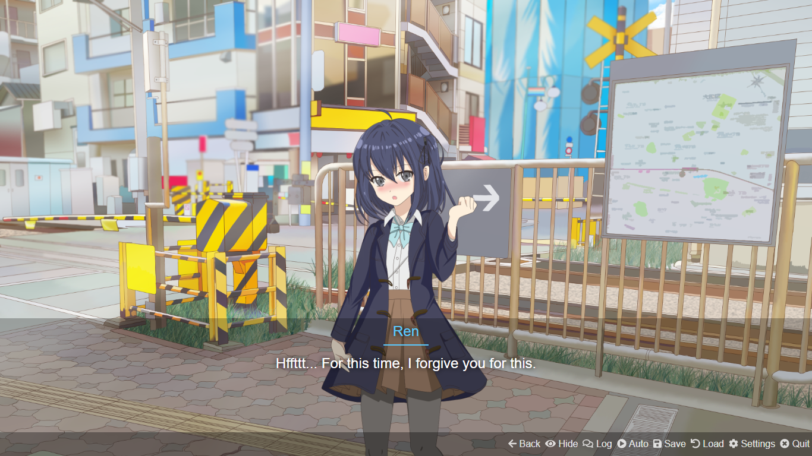

# Eat Together

If you're expecting too much in this game, well don't expected it. It's just a simple VN that I created with [monogatari](https://developers.monogatari.io/documentation/) and it's my first time created it.

Honestly, this VN was created by me, Rainfog, and you can check anything in created by section.

## Synopsis

A guy named Shien was invited by A normal girl who likes to eat cheap food Ren.
But, some path you choose can make Shien know about the world he lives. Nahh, just kidding.

## Gameplay

Just click, click, and click. You can skip story too if you feel the story is so cringe or ugly.

## Your Mission

Simple, just do the story or find the bug. If you find a bug, well chat Rainfog via [Twitter](https://twitter.com/RainfogM), he's more active on than me.

Well, just give me critism and advice, but tell to Rainfog Muzaba, not me, fuehehe.

## Created By

- Programmer [Zhafran Bahij](https://github.com/ZhafranBahij)
- Story [Rainfog Muzaba](https://twitter.com/RainfogM)
- Character and Background [Noraneko](https://noranekogames.itch.io/)
- Music (Honestly, I forgot the place I picked, but the license said I can use it without credit.)
